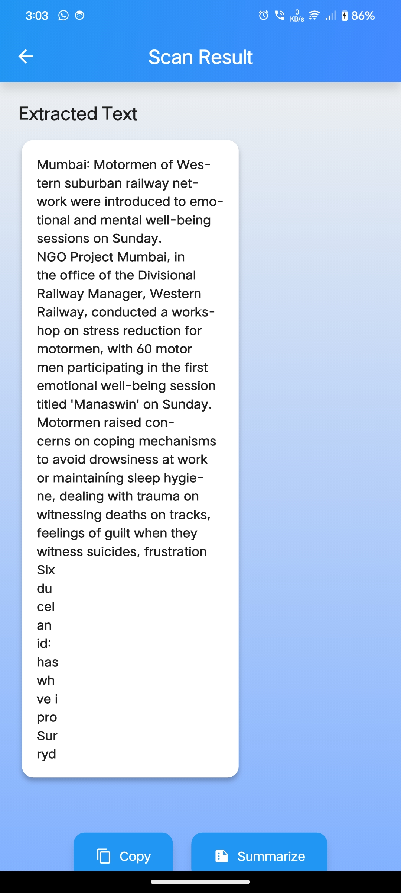
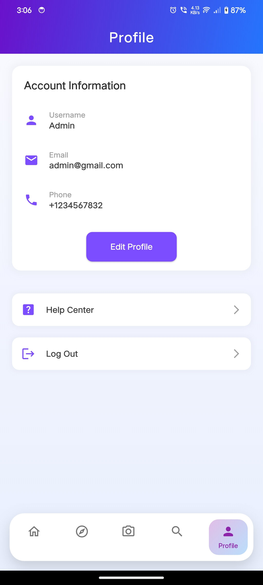

# NewsInsights

**NewsInsights** is a cutting-edge news aggregation platform designed to empower users with the ability to explore, summarize, and verify the credibility of news articles. Built using a Flutter-based frontend and a Python FastAPI backend, this project seamlessly integrates modern mobile UI design with advanced machine learning capabilities to deliver an unparalleled news consumption experience.

---

## 🖼️ App Screenshots

### 🏠 Homepage


### 🎯 Recommendations
<div style="display: flex; gap: 10px; flex-wrap: wrap;">
  
  
  
</div>

### 📄 OCR Workflow
<div style="display: flex; gap: 10px; flex-wrap: wrap;">
  
  
  
</div>

### 📚 Summary Generation


### 👤 User Profile


### 🗂️ Categories
<div style="display: flex; gap: 10px; flex-wrap: wrap;">
  
  
</div>

### 📰 News Details


### 🔐 Authentication
<div style="display: flex; gap: 10px; flex-wrap: wrap;">
  
  
</div>

---

## 🚀 Key Features

- 🔍 **Personalized News Recommendations**: Tailored content based on user preferences  
- 🧠 **Advanced Text Summarization**: Condense lengthy articles into concise summaries using state-of-the-art NLP techniques  
- 🕵️‍♂️ **Fake News Detection**: Evaluate the credibility of news articles with machine learning-driven analysis  
- 🧾 **Optical Character Recognition (OCR)**: Extract text from images for enhanced accessibility  
- ✅ **Secure Authentication & Authorization**: Robust user authentication mechanisms to ensure data security  
- ❤️ **Like & Save Functionality**: Bookmark and like your favorite articles for easy access  
- 🌐 **Cross-Platform Support**: Available on Android, Web, and Windows  

---

## 🛠️ Technologies Utilized

### Frontend (Client)
- **Flutter**: A versatile UI framework for cross-platform app development  
- **Dart**: The programming language powering Flutter  

### Backend (Python)
- **FastAPI**: A high-performance, modern web framework for building APIs  
- **Scikit-learn**, **NLTK**, **Pandas**, **NumPy**: Libraries for implementing machine learning services  
- **MongoDB**: A NoSQL database for efficient storage of user data and interactions  
- **Pydantic**: For robust data validation and serialization  
- **Uvicorn**: An ASGI server to serve the FastAPI application  

---

## 🧰 Project Structure

### `client/` - Flutter Frontend
- `lib/`: Contains UI logic, widgets, and business logic  
- `android/`, `ios/`, `web/`, `windows/`: Platform-specific configurations  
- `pubspec.yaml`: Dependency management and asset configuration  

### `python-backend/` - FastAPI Backend
- `app/config/`: Configuration files for database and environment settings  
- `app/controller/`: Controllers for handling user interactions and recommendations  
- `app/models/`: Pydantic models for request/response schemas  
- `app/routes/`: API route definitions and endpoint mappings  
- `app/services/`: Machine learning services such as summarization, recommendation, and fake news detection  
- `app/utils/`: Utility functions for authentication and other shared operations  
- `main.py`: Entry point for the FastAPI application  
- `.env`: Environment variables for secure configuration  
- `requirements.txt`: Python dependencies for the backend  

---

## 📦 Installation Guide

### Prerequisites
- **Flutter SDK**: Ensure the Flutter SDK is installed and configured  
- **Python 3.8+**: Required for running the backend services  
- **MongoDB**: Either install locally or use a cloud-hosted MongoDB instance  

### 🔧 Backend Setup
```bash
cd python-backend
python -m venv venv
source venv/bin/activate  # On Windows: venv\Scripts\activate
pip install -r requirements.txt
uvicorn main:app --reload
```

### 💻 Frontend Setup
```bash
cd client
flutter pub get
flutter run
```

---

## ▶️ Usage Instructions

1. Start the backend server:
   ```bash
   uvicorn app.main:app --host 0.0.0.0 --port 8000 --reload
   ```

2. Launch the Flutter application on your desired platform:
   - **Mobile**: Run on Android or iOS devices/emulators  
   - **Web**: Use `flutter run -d web-server` to launch the web version  
   - **Desktop**: Deploy on Windows or other supported desktop platforms  

3. Sign up or log in to access the platform's features:
   - Explore personalized news recommendations  
   - Upload images to extract text via OCR  
   - Verify the authenticity of news articles  
   - Generate concise summaries of lengthy articles  

---

## 🤝 Contribution Guidelines

We encourage contributions from the community! To contribute:

1. **Fork** the repository  
2. **Create** a feature branch:
   ```bash
   git checkout -b feature-name
   ```
3. **Commit** your changes:
   ```bash
   git commit -m "Add feature"
   ```
4. **Push** to your branch:
   ```bash
   git push origin feature-name
   ```
5. **Open a pull request** with a detailed description of your changes  

Please ensure your contributions adhere to the project's coding standards and include appropriate documentation.

---

## 📬 Contact Information

For inquiries, feedback, or collaboration opportunities, please reach out to:

**Developer**: Siddiqui Tauseef  
📧 Email: [sidtauseef20020204@gmail.com](mailto:sidtauseef20020204@gmail.com)  
🔗 GitHub: [https://github.com/Sid-Tauseef](https://github.com/Sid-Tauseef)

---

## 📜 License

This project is licensed under the MIT License. See the [LICENSE](LICENSE) file for more details.

---

Thank you for exploring **NewsInsights**! We hope this platform enhances your news consumption experience while promoting accuracy and reliability in information dissemination.
